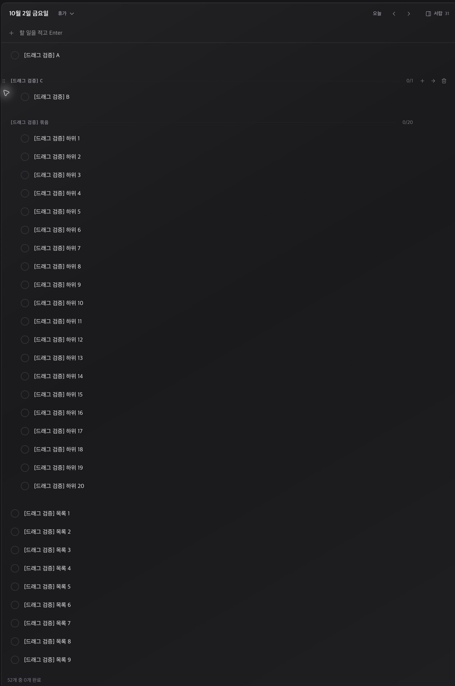
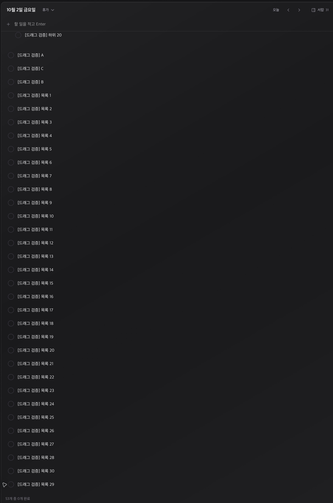

# 앱 드래그 동작 및 데이터 보존

## 검증 대상

- 작업 문서: `../task.md`
- 검증 항목: 설치 앱의 드래그 동작과 실제 DB 저장, 기존 데이터 보존
- 대상 경로/URL/ID: `/Applications/Amber.app`, `dev.jhzlo.amber`, `2026-10-02` 임시 목록

## 실행 환경

- 실행 일시: 2026-10-01 (Asia/Seoul)
- 실행 위치: Amber 로컬 저장소
- 기준 브랜치/커밋: `jun/1`, `fb7171f` 기준 변경
- 실행 환경: macOS, Tauri release 번들을 설치한 네이티브 앱

## 실행 내용

1. 기존 앱 번들과 SQLite DB 백업, 13개 테이블의 내용 해시 기록.
2. 빈 날짜 `2026-10-02`에 임시 항목 54개 생성: A·B·C, 하위 20개를 가진 묶음, 일반 항목 30개.
3. 앱 종료 후 빌드한 번들을 `/Applications/Amber.app`에 설치하고 다시 실행.
4. 앱 화면에서 손잡이를 실제 드래그하고, 화면과 SQLite의 `parent_id`·`sort_order`를 함께 확인.
5. 임시 항목의 ID·내용·날짜를 대조해 54개만 정리하고 전체 테이블 내용 해시 비교.
6. 앱 재실행 후 기존 업무 화면으로 복귀.

## 결과

| 실제 드래그 | DB·화면 확인 |
| --- | --- |
| B를 A 위로 | 루트 순서 B → A → C |
| B를 C 아래로 | 루트 순서 A → C → B |
| B를 C의 하위로 | B의 부모가 C로 저장되고 하위 화면 표시 |
| B를 다시 최상위로 | B의 부모 NULL, 루트 순서 A → C → B |
| 하위 20개 묶음을 맨 위로 | 묶음 → A → C → B, 하위 20개의 부모 유지 |
| 긴 목록을 스크롤한 뒤 30번을 29번 위로 | 끝 순서 27 → 28 → 30 → 29, 드롭 전후 상단 표시 항목의 위치 유지 |

실제 앱에서는 드롭 후 결과를 캡처했다. 드래그를 잡은 상태에서 휠 스크롤·Esc·창 전환을 결합하는 연속 동작은 DOM 회귀 테스트로 확인했다.

- 임시 54개 정리 완료, 테스트 날짜 항목 0개.
- 기존 13개 테이블의 행 개수와 내용 해시 모두 동일.
- [실제 DB 조회 결과에서 추출한 검증 요약](../raw/runtime-results.json).
- 전체 조회 결과와 해시 자료는 로컬 보관. 아래 이미지는 실제 앱 캡처에서 임시 목록 영역을 잘라낸 것이다.

### 하위 항목 드롭 결과

### 스크롤 후 드롭 결과

추가 증빙: [초기 목록](assets/01-before-drag.jpg), [묶음 이동](assets/06-group-drop.jpg), [스크롤한 목록의 드롭 전 상태](assets/07-scrolled-list.jpg).

## 판단

- 결과: 통과
- 요약: 설치 앱에서 순서·부모 변경과 묶음 이동이 실제 저장됐고, 검증 항목 정리 후 기존 데이터의 내용이 동일하다.
- 근거: 앱 화면, 드롭별 DB 조회, 13개 테이블 해시 비교.
- 남은 리스크: 연속 포인터·휠 입력 조합은 자동 DOM 테스트로 확인했으며, 실제 앱의 드래그 중 모든 프레임을 기록한 것은 아니다.
